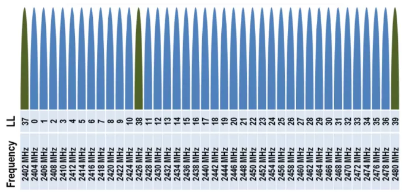
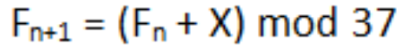
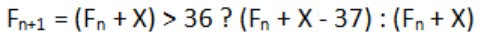
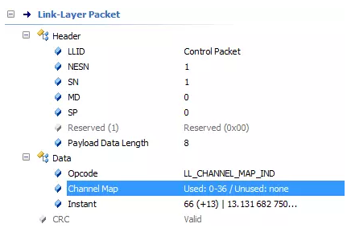

# BLE信道和自适应跳帧
* 信道 
在物理层，因为调制参数放宽，所以BLE和经典蓝牙的信道并不相同，而是只有40个信道，因为功率谱更宽，为了避免相邻信道的干扰，采用2MHz的信道宽度。 
在链路层，将40个信道分为广播信道和数据信道，37个是数据信道，3个广播信道。40个信道最低的中心频率为2402MHz，最高的为2480MHz。第一个信道的频率为2402，以后每一个信道加20MHz。 
广播信道分散在距离较远的频段上，过度的集中会导致如果该频段受干扰严重可能广播就无法进行的情况，分散的目的是为了增加容错率。 
而广播频道的选择主要是考虑到WIFI接入点的干扰。这些接入点通常选择802.11的信道1/6/11三个信道，分别占据**2402MHz-2422MHz，2427MHz-2447MHz，2452MHz-2472MHz**;而BLE的广播信道则分别为**2402MHz,2426MHz,2480MHz**,也就意味着第一个广播信道低于wifi信道1，第二个广播信道位于WIFI信道1和6之间，第三个广播信道高于11号信道，正好避免了三个Wifi常用接入点信道的覆盖，避免了他们的干扰。 
 
如上图所示，广播信道的编号是37-39，数据信道的编号是0-36，这样标号的目的是降低跳频算法的实现难度。 
* 跳频 
连接状态中链路采取跳频的技术避免环境中的干扰，而BLE的跳频算算法其实很简单，就是一个在37个数据信道之间的等概率转换。 
最常见的一种是模37的方法： 
 
X取一个5-16之间的值。采取这样数值的原因，应该是使得跳频图图谱更加均匀，不至于两个频率隔得太近，以至于环境干扰无法通过环境干扰消除。 
当然我们也可以采取加减法实现该算法，就是加上X,然后判断结果大于36，就减去37： 
 
* 自适应跳频 
自适应跳频技术原理也很简单，每次数据传输之后我们进行对信道质量进行评估，如果我们认为当前信道质量较差，我们将它从可用信道列表中删除，这是一个通用的思路。 
具体到BLE中，自适应跳频技术是将一个坏掉（干扰严重）的信道映射到一个好信道，当跳频算法跳到该坏信道时，实际采用的是他映射的那个好的信道进行数据的传输。 
 
如上图所示，主设备通过LL_CHANNEL_MAP_REQ数据链路层管理包来进行新的信道图的同步与更新。 
 
OTA packet 
如上图，我们看到实际的空口包中信道图的信息。 