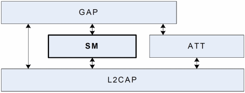
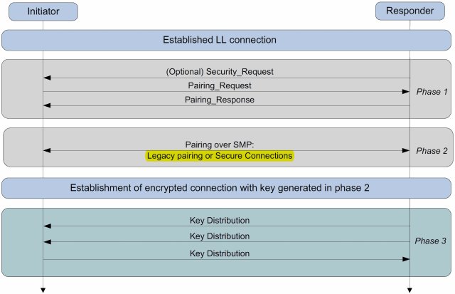
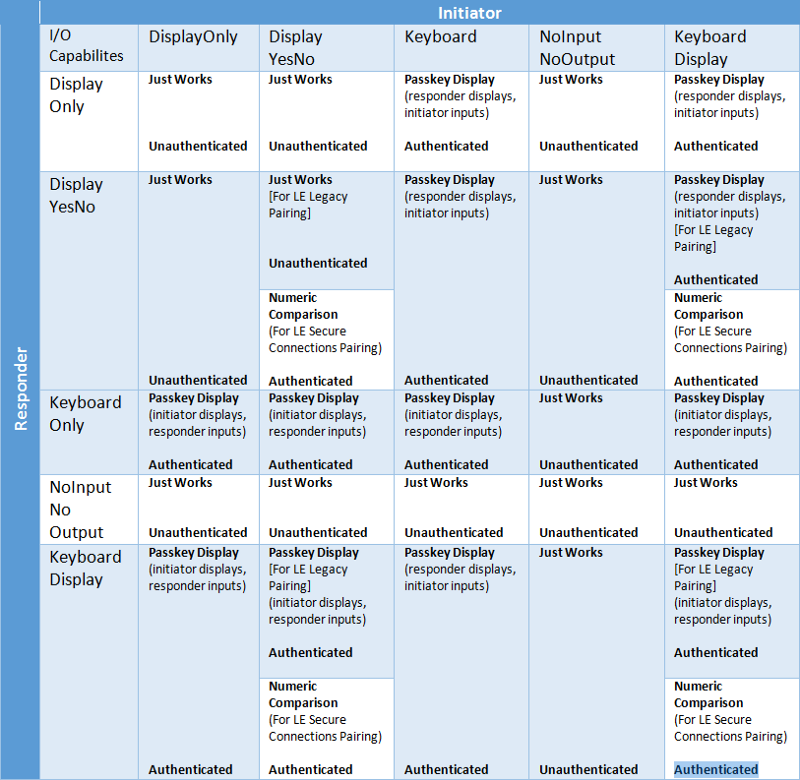
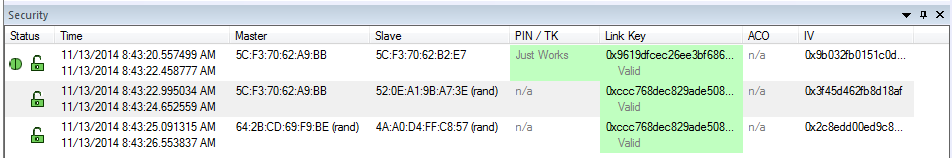
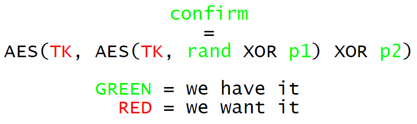

# BLE协议安全机制Security Manager

1. Security Manager介绍</br>
SM在蓝牙协议中的位置如下图：</br>
</br>
它的主要目的是为LE设备（LE only或者BR/EDR/LE）提供建立加密连接所需的key（STK or LTK）。为了达到这个目的，它定义了如下几类规范：</br>
    ```bash
    1）将生成加密key的过程称为Pairing（配对），并详细定义了Pairing的概念、操作步骤、实现细节等。
    2）定义一个密码工具箱（Cryptographic Toolbox），其中包含了配对、加密等过程中所需的各种加密算法。
    3）定义一个协议（Security Manager Protocol，简称SMP），基于L2CAP连接，实现master和slave之间的配对、密码传输等操作。
    ```
2. Pairing（配对）</br>
在SM的规范中，配对是指“Master和Slave通过协商确立用于加（解）密的key的过程”，主要由三个阶段组成：</br>
</br>
阶段1，称作“Pairing Feature Exchange”，用于交换双方有关鉴权的需求（authentication requirements），以及双方具有怎么的人机交互能力（IO capabilities）。</br>
阶段2，通过SMP协议进行实际的配对操作，根据阶段1 “Feature Exchange”的结果，有两种配对方法可选：LE legacy pairing和LE Secure Connections。</br>
阶段3是可选的，经过阶段1和阶段2之后，双方已经产生了加密key，因而可以建立加密的连接。加密连接建立后，可以互相传送一些私密的信息，例如Encryption Information、Identity Information、Identity Address Information等。

3. Pairing Feature Exchange</br>
配对的过程总是以Pairing Request和Pairing Response的协议交互开始，通过这两个命令，配对的发起者（Initiator，总是Master）和配对的回应者（Responder，总是Slave）可以交换足够的信息，以决定在阶段2使用哪种配对方法、哪种鉴权方式、等等，具体包括：</br>
    3.1 配对方式：</br>
    Master和Slave有两种可选的配对方法：LE legacy pairing和LE Secure Connections。</br>
    
    4.0和4.1设备：</br>
    4.0和4.1设备的配对过程（也称为LE Legacy Pairing）使用BLE标准特有的自定义密钥交换协议。在此设置中，设备交换临时密钥（TK）并使用它创建短期密钥（STK），用于加密连接。这个过程的安全性在很大程度上取决于用于交换TK的配对方法，因此本文后面将详细介绍每种配对方法。配对过程以如下所示的一系列阶段进行。</br>

    阶段一：此阶段在发起设备向另一设备发送“Pairing_Request”时开始。然后，这两个设备交换I / O功能，身份验证要求，最大链路密钥大小和绑定要求。基本上所有这一阶段都由两个设备交换其功能并确定如何建立安全连接。同样重要的是要注意，在此阶段交换的所有数据都是未加密的。</br>
    阶段二：第一阶段完成后，设备使用其中一种配对方法生成和/或交换TK。然后，两个设备将交换Confirm和Rand值，以验证它们是否都使用相同的TK。一旦确定，他们将使用TK和Rand值来创建STK。然后使用STK加密连接。</br>
    阶段三：此阶段是可选阶段，仅在第一阶段交换粘合要求时使用。在此阶段，交换了几个传输专用密钥。这些键及其功能的完整列表可以在本文的附录中找到。</br>
    
    4.2设备：</br>
    BLE 4.2设备完全向后兼容BLE 4.0和4.1设备，这意味着4.2设备能够执行与4.0和4.1设备完全相同的配对过程。但是，BLE 4.2还能够创建所谓的LE安全连接。LE Secure Connections使用单个长期密钥（LTK）来加密连接，而不是使用TK和STK。使用椭圆曲线Diffie Hellman（ECDH）公钥密码术来交换/生成该LTK，与原始BLE密钥交换协议相比，其提供了显着更强的安全性。</br>
    
    在LE安全连接中，配对过程的第一阶段和第三阶段与LE Legacy连接中的完全相同。因此，唯一的差异发生在配对过程的第二阶段。</br>
    
    第二阶段在LE安全连接中的工作方式如下。两个设备都生成ECDH公钥 - 私钥对。然后，这两个设备将交换其公钥，然后开始计算Diffie-Hellman密钥。然后使用其中一种配对方法来验证连接。验证连接后，将生成LTK并加密连接。</br>
    
    3.2鉴权方式：</br>
    
    IO的能力可以归纳为如下6种：</br>
    NoInputNoOutput</br> 
    DisplayOnly</br>
    NoInputNoOutput1</br>
    DisplayYesNo</br>
    KeyboardOnly</br>
    KeyboardDisplay</br>
    IO capabilities exchange决定了后续加密方式的选择。</br>
    </br>
    根据不同的IO方式，采用不同的鉴权方式：</br>
    对于蓝牙4.0，4.1，4.2：</br>
    1. Just Work
    在此方法中，TK设置为0.因此，攻击者很容易强行攻击STK并窃听连接。同样，该方法也无法验证参与连接的设备，因此它不提供MITM保护。
    </br>
    
    2. Passkey entry
    在该方法中，TK是由用户在设备之间传递的6位数字。转移此号码的方式可能有所不同。一个例子是让其中一个设备产生一个随机的6位数字并将其显示在LCD显示器上。然后，用户将读取该号码并使用键盘将其输入另一个设备。</br>
    如果攻击者没有监听到配对过程，那么密钥可以对通讯过程提供很好的保护，但是如果攻击者嗅探到了配对过程，就可以通过暴力手段破解TK/PIN与STK。</br>
    破解TK/PIN与LTK：</br>
    </br>
    （抓包后，可以使用[Crackle](https://github.com/mikeryan/crackle)，获取TK/PIN与TLK）
        ```bash
        Analyzing connection 0:
          xx:xx:xx:xx:xx:xx (public) -> yy:yy:yy:yy:yy:yy (public)
          Found 13 encrypted packets
        
          Cracking with strategy 0, 20 bits of entropy
        
          !!!
          TK found: 412741
          !!!
        
          Decrypted 12 packets
          LTK found: 81b06facd90fe7a6e9bbd9cee59736a7
        
        Specify an output file with -o to decrypt packets!
        ```
    
    3. Out of band</br>
    由配对的双方，在配对过程之外，额外的交互一些信息，并以这些信息为输入，进行后续的配对操作。这些额外信息也称作OOB（out of band），OOB的交互过程称为OOB protocol（比如通过NFC，红外辅助方式）。
    
    4. 数字比较（LE安全连接配对）</br>
    仅适用于BLE 4.2：此方法使用称为椭圆曲线Diffie-Hellman（ECDH）的算法进行密钥生成，并使用新的配对程序进行密钥交换。
    
4. 绑定方式：</br>
非可绑定模式：</br>
设备不会交换或存储任何密钥。</br>
绑定模式：</br>
为了接受绑定请求，外设必须在配对期间在配对请求消息的认证要求中设置绑定位。设备交换安全密钥并存储它们。</br>

    