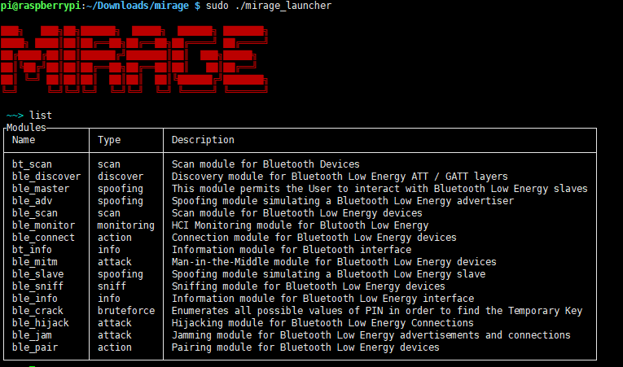
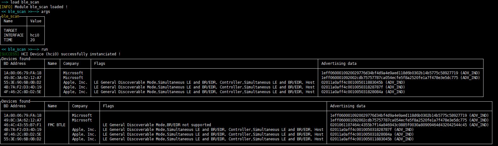
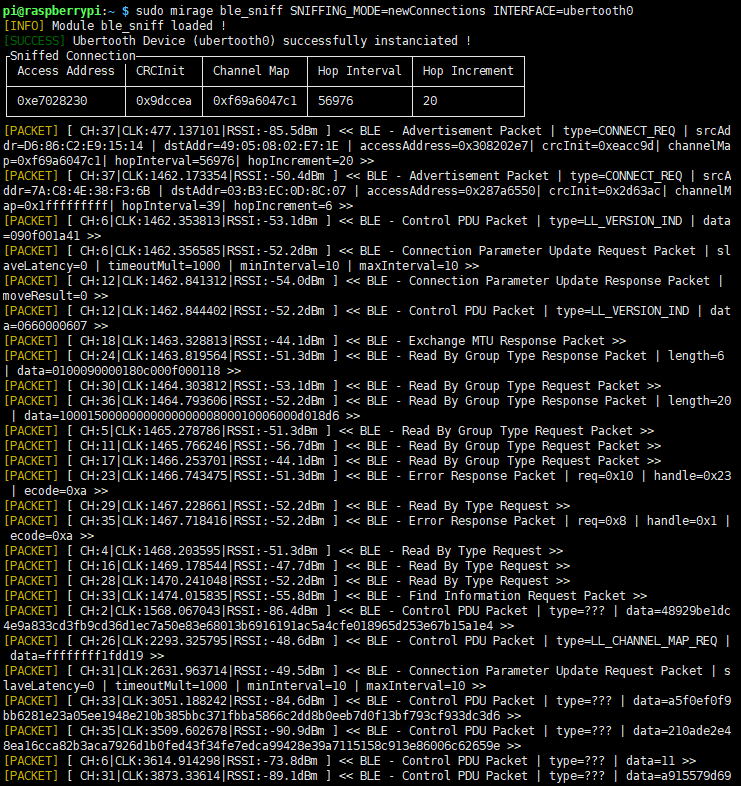
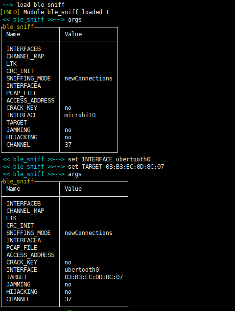
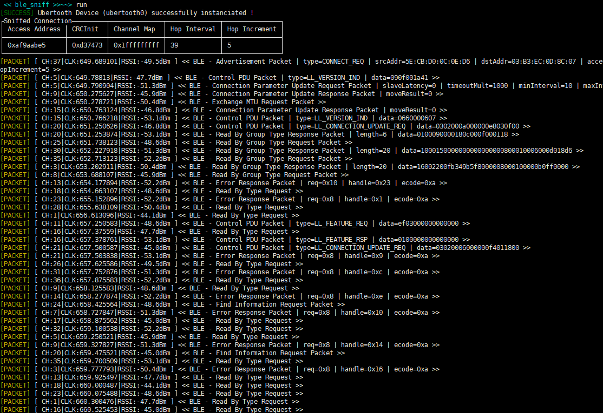


# BLE 工具mirage安装使用
项目地址：http://homepages.laas.fr/rcayre/mirage-documentation/index.html
ash
1. 安装mirage
    ```bash
    git clone https://github.com/secdev/scapy
    cd scapy
    sudo python3 setup.py install
    
    git clone git://redmine.laas.fr/laas/mirage.git
    sudo python3 setup.py install # 安装
    ```
2. mirage使用
    1. 看看有啥模块
    
    2. 扫描一下有啥ble
    ```bash
    load ble_scan # 使用ble_scan扫描
    args # 配置参数
    run # 开始扫描
    ```
    
    
    3. sniffer
    ```bash
    sudo mirage ble_sniff SNIFFING_MODE=newConnections INTERFACE=ubertooth0 # 可以使用这个命令一次完成对新连接的sniffer
    ```
     
     
    ```bash
    # 或者你可以这样
    sudo mirage # 启动mirage
    load ble_sniff # 使用sniff模块
    args # 显示需要配置的参数
    set INTERFACE ubertooth0 # 设置使用那个设备开始监听
    set TARGET 03:B3:EC:0D:8C:07 # 配置监听目标
    args # 打印配置好的参数
    ```
    
    
    ```bash
    run # 开始sniff， 你需要多试几次
    ```
    打开手机开始尝试连接外设，你可能需要多尝试几次，运气好的话，可以看到如下图：</br>
    
    
   