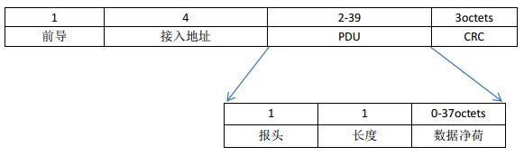
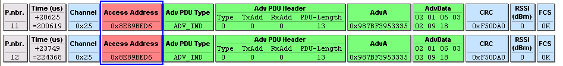
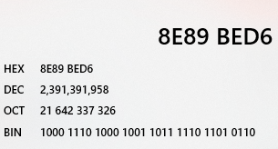
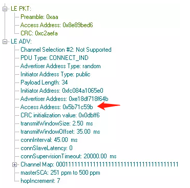
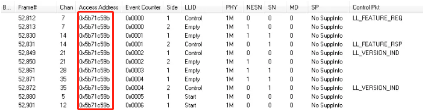
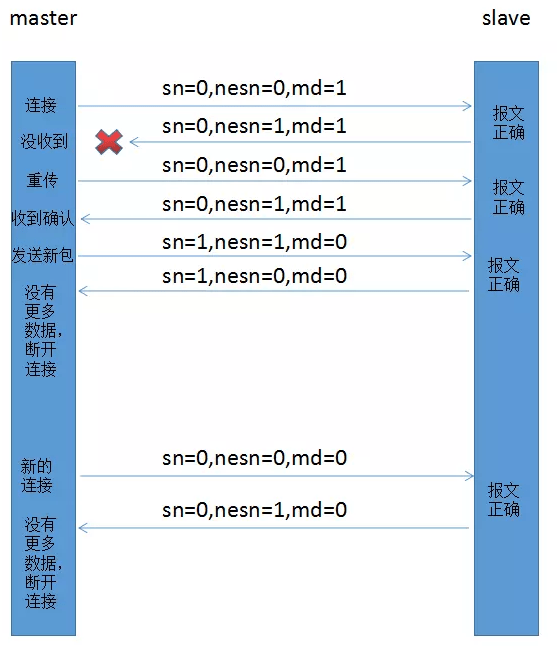
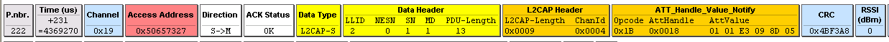
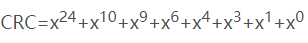

# BLE报文结构
https://www.cnblogs.com/aikm/p/5022502.html 
https://blog.csdn.net/yk150915/article/details/87109312
## 数据链路层报文结构 
BLE报文只有两种，广播报文与数据报文，都遵循BLE报文格式，具体格式如下：
 
### 前导 
前导是一个8比特的交替序列。他不是01010101就是10101010，取决于接入地址的第一个比特。 
    ** 若接入地址的第一个比特为0：01010101 
    ** 若接入地址的第一个比特为1：10101010 
接收机可以根据前导的无线信号强度来配置自动增益控制。该序列之所以非常重要，是因为芯片必须能够应对输入信号强度的可能范围。接收机需要应付“-10dBm - -90dBm”的信号强度，也就是80dB的动态范围。从接收机的角度讲，也就是“1pW - 0.1mW”的能量。自动增益控制器必须检测出输入信号的能量等级，并调整增益，使得信号刚好处于接收机能够轻松工作的范围之中。 
### 接入地址 
接入地址是一个32位的地址，包含两种类型: 
** 广播接入地址（广播数据，扫描或者发起连接） 
** 数据接入地址（两个设备建立连接之后） 
打开接收器之后，接收器同时可能接收到噪音和正常的BLE通讯，接入地址就是区别底噪与正常报文的手段。 
链路层也不知道其他设备什么时候会发送报文，因此只能保留最近 40μs 接收到的比特，并在新的比特移入到寄存器的时候检查序列是否满足前导和接入地址。这一过程称为与接入地址求相关。 
广播报文信道，接入地址是固定值“0x8E89BED6”，抓包显示如下： 
 
发送时的二进制形式如下（从左到右）： 
01101011011111011001000101110001 
 
我们仔细看一下，就能发现数组和上图中BIN中的数据是反着的，这里牵扯到传输排序，知道就好了，知道这个就可以导出前导值了。 
对于数据信道，接入地址是一个随机值，不同的连接有不同的值。这一随机值也需要符合一些规定，主要是为了保证接入地址有足够好的白化特性。 
如下图，连接请求包使用协商通知新的地址，此处为0x5b71c59b 
 
如下图，连接过程中使用的地址则为connect_ind中协商 
 
其实关于Access Address是还有一些要求的，如不能有连续的6个1 bit位或6个连续的0 bit位，因此这样算下来，满足作为Access Address的4byte的组合中有231个是可用的。 
### PDU 
#### 报头 
广播报头： 
`1byte = 8bit`

| 广播报文类型 | 保留 | 发送地址类型 | 接收地址类型 |
|--------|----|--------|--------|
| 4      | 2  | 1      | 1      |

广播报文类型包括7种： 
> ADV_IND —— 通用广播指示 
> ADV_DIRECT_IND —— 定向连接指示 
> ADV_NONCONN_IND —— 不可连接指示 
> ADV_SCAN_IND —— 可扫描指示 
> SCAN_REQ —— 主动扫描请求 
> SCAN_RSP —— 主动扫描响应 
> CONNECT_REQ —— 连接请求 

其中根据其作用域，还可以将他们分为三类:
> ADV_* 属于广播数据单元 
> SCAN_* 属于扫描数据单元 
> CONNECT_* 属于发起数据单元 

发送地址类型和接收地址类型都是BLE地址类型，只有两种，公有地址和随机地址，因而用一个bit就可以进行区分。公有地址是需要向IEEE申请和购买的类似于公网ip，但是随机地址则不需要。 

数据报头： 

| 链路层标识符 | 下一次报文序号 | 序号 | 更多数据 | 保留 |
|--------|---------|----|------|----|
| 2      | 1       | 1  | 1    | 3  |

逻辑链路标识符，主要是用来判断数据报文的类型：

> 链路控制报文（11）—— 链路层用来进行管理连接的控制报文，这种类型的报文直接交给链路层来进行处理。 
>上层报文的开始（10）—— 表明该报文是属于host，需要交给host才能进行解读和处理，因为host最多能够发送27个字节的数据，但是无法一次性放入单个链路层数据报文，因此需要将它截成几段进行传输，该标志位用于标识host报文的初识包。 
> 上层报文的延续（01）—— 标识host数据包的后续包。 

**序列号**：建立连接后的第一个数据包序号为零；每次发送新的数据包时，其序列号与上一个数据包的序列号不同；也就是说，如果序列号与上一个数据包的序列号相同则为重传报文，如果不同则是新的报文。 
**期待序列号**：期待序列号，就是告诉对方自己期待的序列号。这其实起到一个数据包确认的作用，如果确认数据包的期待序列号和发送的序列号相同，则说明对方期待我们重传刚刚的数据包，如果是不同的，则是希望我们发送新的数据报文。 
**更多数据**：更多数据位是用来告之对方，我方是否还有下一个数据包要发送，如果该位设置为1，则表明仍有数据要传送，对方则选择保持连接；设为0，则表明没有更多数据要进行发送，对方则会断开连接，节省能量。 
看下图，其中： 
`sn = 序号，nesn = 下一次报文序号，md = 更多信息` 
 
1. SN和NESN除了可以用来确认数据，保证数据的准确送达。 
2. NESN除了确认数据，还可以用来进行流控制，当我方缓存区紧张时，可以不发送NESN给对方，使对方重发来 等待我方释放足够的缓存区在进行确认处理。 
3. 当报文CRC校验失败时，认为报文传输失败，要求重传。 
4. 在同一连接里，出现两次数据包接受出错，则停止该连接，进行重新连接发送数据，这说明该信道很大的可能被干扰导致质量较差，需要重新连接更换信道。 
#### 长度
长度这个数据段很简单，表示数据段的实际数据的长度。 
对于广播报文，该段是由6个bit组成，剩余两个bit留作未来使用； 
对于数据报文，该段是由5个bit成，剩余三个bit留作未来使用，未加密报文的净荷也不允许超过27个字节的限制，以减低链路层缓存的复杂度； 
他们长度需要bit不相同的原因是，广播数据报文多了6个字节的设备地址需要携带，因为需要6bit来标识长度； 
连接成功之后通信过程中数据报文的抓包显示如下： 
 

> 从上述的截图中我们可以看到“Data Header”中的“PDU-Length”就是数据报文中净荷数据的实际长度，该值最多27个字节。净荷部分包含“L2CAP Header”和ATT，其中“L2CAP Header”占用了4个字节，而ATT中Opcode和AttHandle一共占用了3个字节，剩下的AttValue最多只能有20个字节了，而AttValue就是应用层实际发送的数据，所以我们看到很多资料中提到BLE每个包最多发送20个字节的数据，就是这个原因。 
> 注意上述截图中“Data Header”中的“PDU-Length”显示的是十进制，也就是上述截图中实际净荷长度是13个字节即“L2CAP Header”和ATT部分实际长度是13个字节，而“L2CAP Header”中的“L2CAP-Length”是十六进制，表示的是后面ATT部分的实际数据长度，图中为9个字节，抛去ATT的Opcode和AttHandle占用了3个字节之外，剩下的AttValue刚好是6个字节。 

### 数据（净荷）
最大传输的数据是31个字节，但是如果数据被加密，需要留出4个自己进行数据完整性校验。 
### 循环冗余校验码
24bit的循环校验码，可以校验所有基数位以及所有2，4位错误，显然其并不能校验所有位错误，但是出于低功耗考虑，这是一个妥协的产物。 
该24位CRC的生成多项式如下： 
