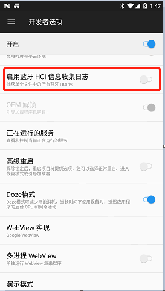
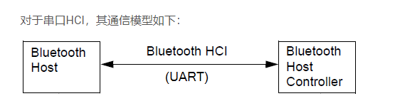
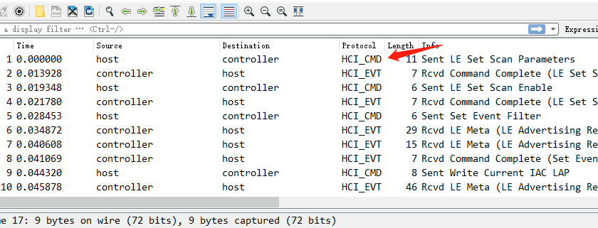
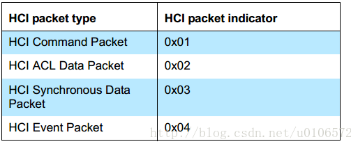
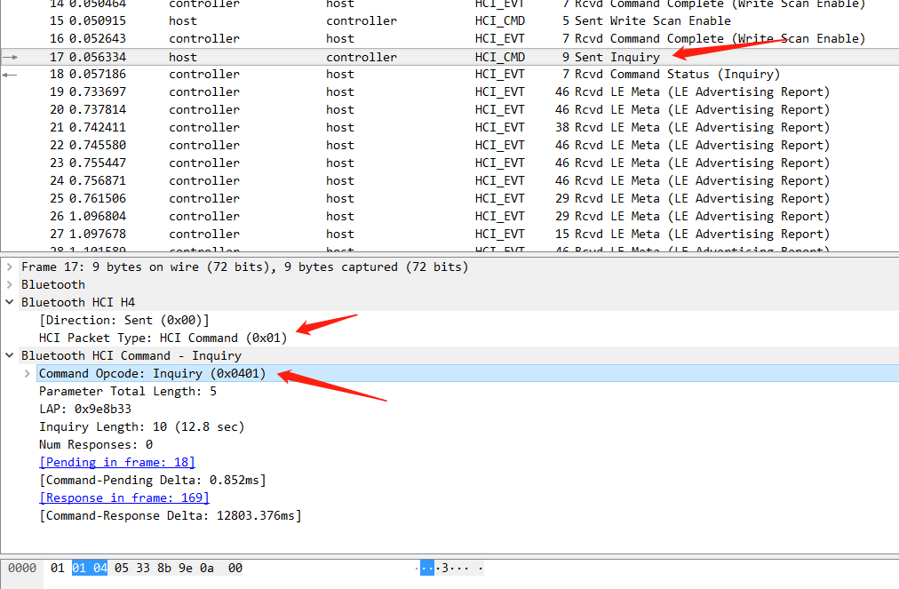
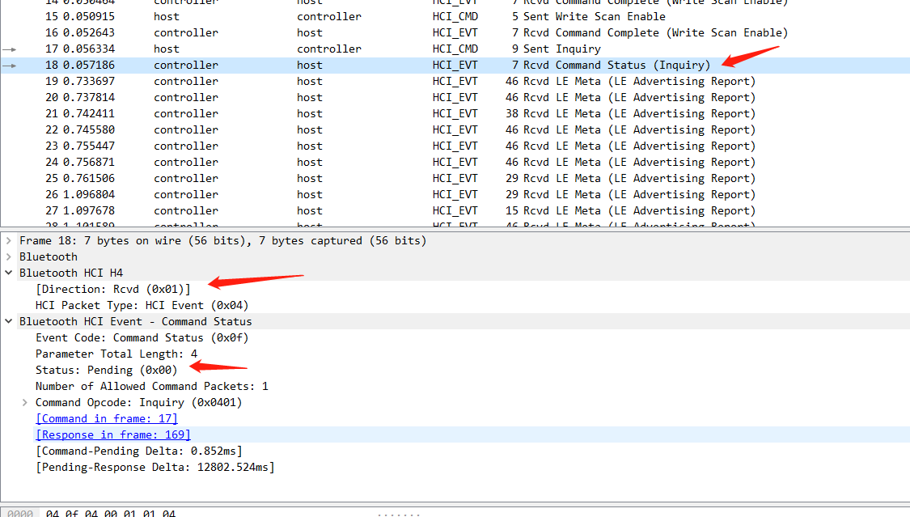
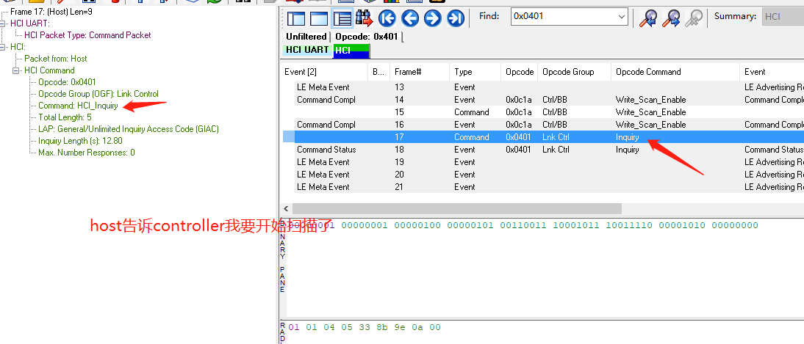
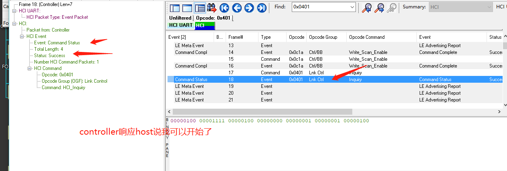
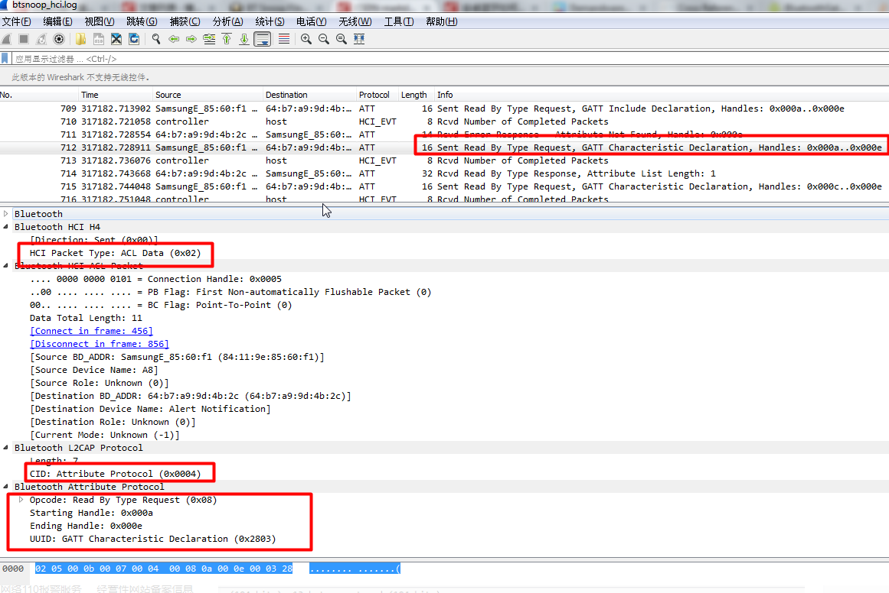
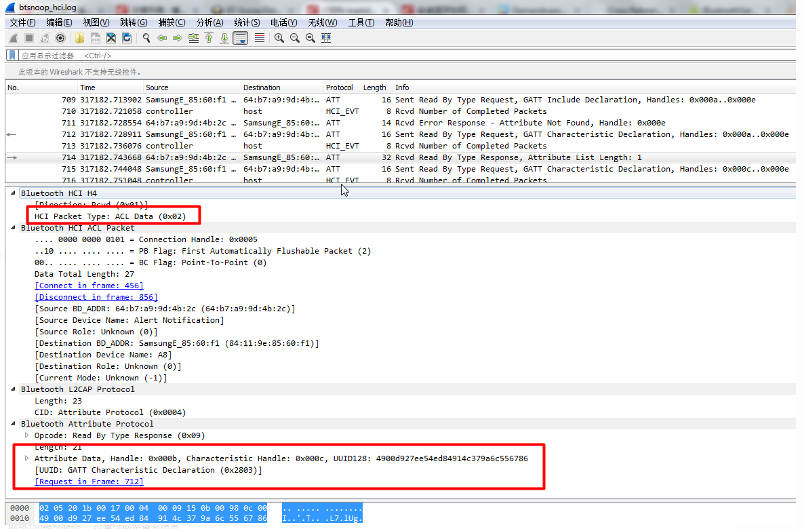

# HCI抓包
            
1. 打开开发者选项 
 
然后不出意外的话，你的收集sdcard下面就会找到相关日志了，不过不同的收集配置不一样，你可能需要找一下他在哪。 
`cat /etc/bluetooth/bt-stack.conf | grep BtSnoopFileName` 
导出文件... 
(HCI模型，看图，手机端BLE模型中host和controller之间的数据，不是直接抓取手机和外设之间的报文。) 
 
下面就是wireshark和frontline-viewer分析日志了，我大概分析了一下，主要是装逼用的啊…… 
 
 
看不明白吧，先扫盲: 
`HCI Command Packet：host发给controller，主要是HCI 命令， 注意是命令，不是数据。`
`HCI Event Packet：controller发给host。对应于command packet。`
`HCI ACL Data Packet： host发给controller或者相反。主要是L2CAP发送和接收的数据，我们上层的所有数据，注意是数据，而不是命令，都是通过这个type来传递的。`
`HCI Synchronous Data Packet：用来传输语音（SCO）数据的。注意一般都会通过PCM接口来传输SCO数据。`
来个例子我们讲一讲，能懂多少就懂多少啊…… 
对于一些设置名字，读取本机蓝牙地址等等的命令，都是通过HCI command packet来做的，例如： 
 
Controller响应host消息 
 
我们用view看一下，这个就比较直观了 
 
 
而发送出去的和接收的上层数据都是通过ACL data packet的type来完成的 
 
 
于是一来一回，我们就可以知道stack自己发出去（实际上是尝试发给controller）的数据，与我们从app发到stack的数据，以及stack接收到的数据，和发送到app的数据，是否一致，是否有遗漏。 