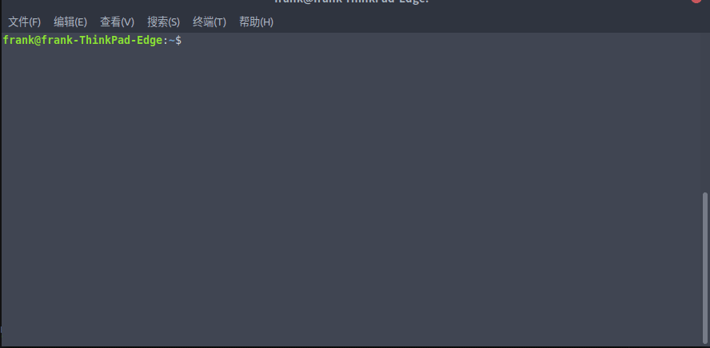

# ble其他常见工具介绍
* [BlueZ](http://www.bluez.org/download/)也是一个比较好的选择，他能让你看起来比较黑客：</br>
    ```bash
    apt-get install 或者下载编译，这个你的看看你的Linux环境
    ```
    在这之前也许你的先买个usb BLE设备，大概就是这样的：</br>
    </br>
    买一个就好了，我们看看这几个命令</br>
    ```
    hciconfig #查看蓝牙设备状态
    sudo hciconfig hciX up #唤醒蓝牙设备
    sudo hcitool lescan #扫描ble设备
    sudo gatttool -t -random -b MAC -I 
        #> connect #连接设备
        #> primary #遍历service
        #> characteristic #遍历chara
        #> 还有好多命令，大佬自己看吧
    ```
    下面有个动图，大佬自己看看，装逼专用
    
    

* 中间人[Gattacker](https://github.com/securing/gattacker)</br>
工具[快速入门](https://www.freebuf.com/articles/network/167132.html)，这是个翻译，大佬不屑的话可以去看英语啊……</br>
看完了基本你就会了</br>
看看我自己的图：</br>
</br>
</br>
