# nRF connect
## 入门
[从这里下载](https://apkpure.com/)</br>
下载安装后，打开App，界面是这样的：

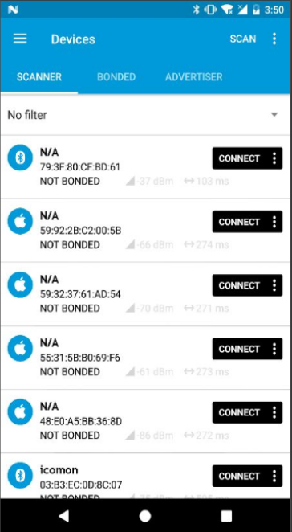</br>
向下拉可以自动重新扫描BLE设备。</br>
我们来关注icommon这个设备：</br>
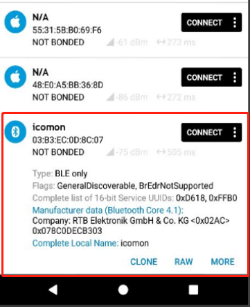</br>
其中:</br>
```bash
03:83:ec:XX:XX:xx表示扫描到的设备的地址</br>
NOT BONDED表示设备现在还没有与手机绑定</br>
Type表示你扫描到的设备是支持蓝牙版本，在这里只支持BLE</br>
Flags表示设备属性，这里是可被发现，不是耳机
Complete list of 16-bit Service UUIDs就是蓝牙通道UUID了
Manufacturer data蓝牙栈版本
Company蓝牙芯片公司信息
complete local name扫描到的蓝牙的名称
```
你可以点击more再看看

点击连接后，自动跳转到新页面，他是这样的：</br>
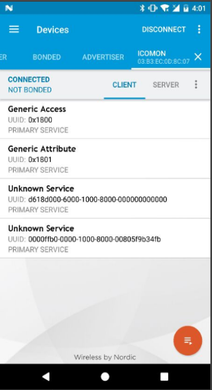</br>
这里列举了BLE所有的服务，点击可以查看相关desc的信息，包含读写属性。</br>
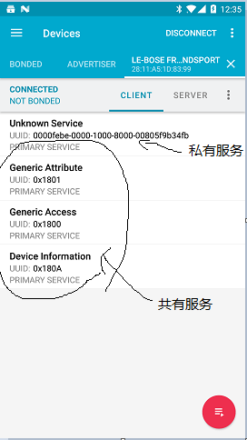</br>
你可以每个都点点看看</br>
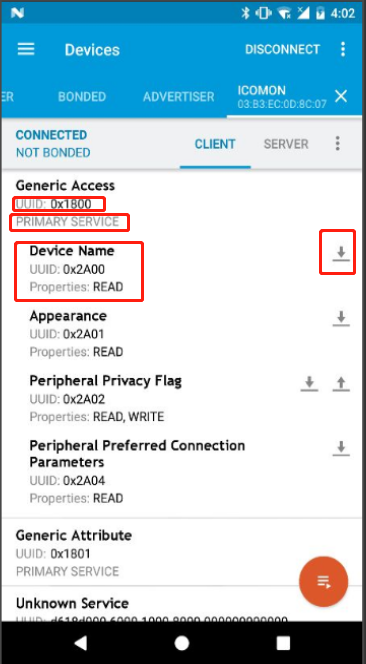</br>
其中UUID表示这个通道的编号，主要是用来和其他通道区分的，我们来看看Device Name，有一项叫做Properties，它是用来表示这个通道可读可写的属性，这里是READ，右边有个向下的小箭头，我们可以点击他来获取Device Name的值：</br>
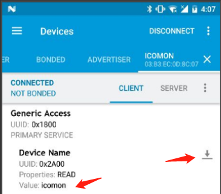</br>

有时候有些通道是可读可写的，它是这样</br>
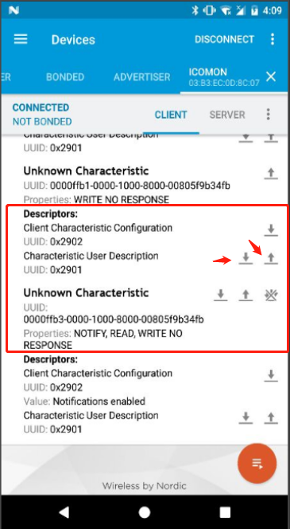</br>
读取我们都已经讲了，现在看看写入，点击向上箭头：</br>
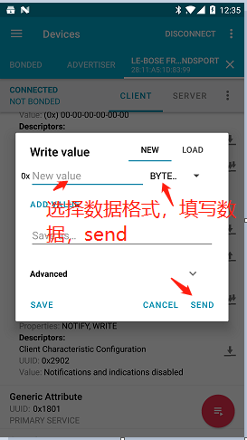

看，其实这里你就可以操作你的外设了。是不是...

## 用它来尝试抓包？

我们先重启nRF connect app，然后回到桌面，点击与外设连接的app，今天我们的目标是mfit，一个体脂秤</br>
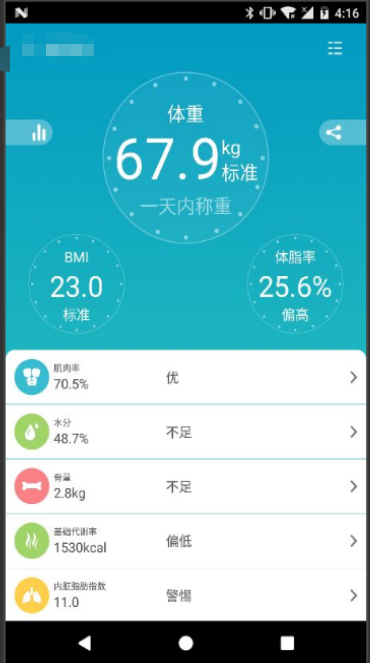</br>
体脂秤app打开后自动扫描，连接到了体脂秤，现在我们切换到nRF connect中</br>
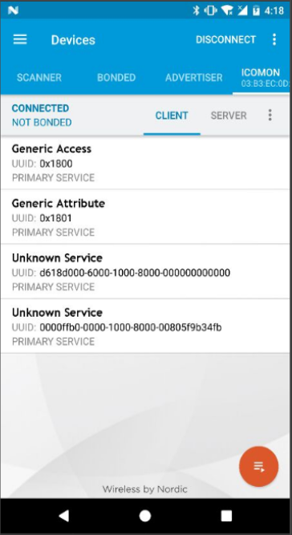</br>
现在nRF connect已经自动跳转到这里了，我们可以通过点击右上角</br>
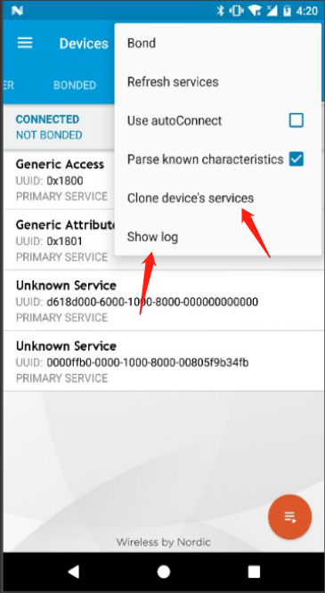</br>
这里又两项：
* clone devices services 这一项是用来克隆外设的，可以再后期模拟外设使用
* show log 这一项可以用来抓包

选择show log就可以看到手机app与体脂秤之间的数据交换了（比一定能抓到，别打我）</br>


