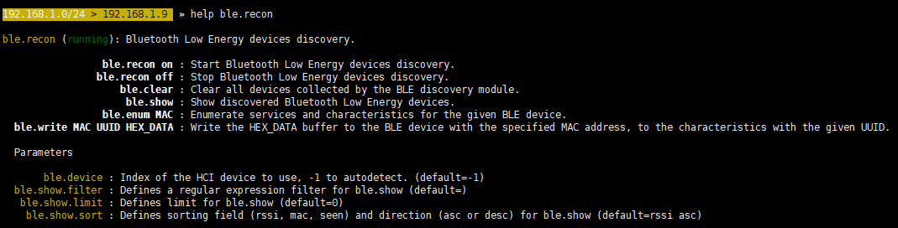
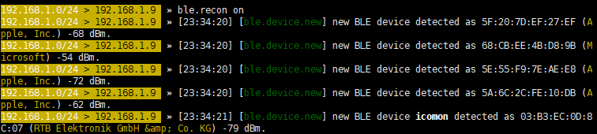
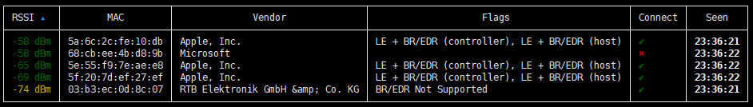
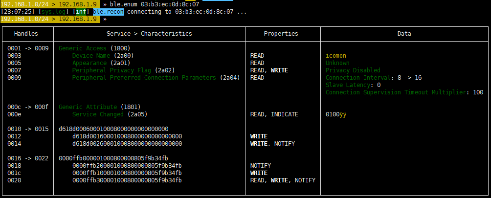

# raspberry ble bettercap

## 原因

bleah项目并入了bettercap中，想要了解ble设备的基本信息就需要安全bettercap
* Bluetooth Low Energy devices scanning, characteristics enumeration, reading and writing.
    
## 安装bettercap

1. Install Golang 1.10

    ```bash
    wget https://storage.googleapis.com/golang/go1.10.1.linux-armv6l.tar.gz
    sudo tar -C /usr/bin -xvf go1.10.1.linux-armv6l.tar.gz
    cat >> ~/.bashrc << 'EOF'
    export GOPATH=$HOME/go
    export PATH=/usr/bin/go/bin:$PATH:$GOPATH/bin
    EOF
    source ~/.bashrc
    ```


2. Install bettercap
    ```bash
    go get -u github.com/bettercap/bettercap # 安装在~/go/bin/bettercap
    ```
## 扫描/显示ble信息

1. 找到bettercap

    ```bash
    cd ~/go/bin/
    sudo ./bettercap
    ```
    
    
    bettercap提供如下功能
    

2. 查看扫描结果
    ```bash
    ble.recon on # 开始扫描
    ```
    
    ```bash
    ble.show # 查看扫描结果
    ```
    
    
3. 显示目标信息
    ```base
    ble.enum mac #ble.enum mac地址
    ```
    


