# ubertooth raspberry pi 3配置指南

1. 安装依赖
    ```
    sudo apt-get install cmake libusb-1.0-0-dev make gcc g++ libbluetooth-dev pkg-config libpcap-dev python-numpy python-pyside python-qt4
    ```
    
2. 安装libbtbb
    ```
    wget https://github.com/greatscottgadgets/libbtbb/archive/2018-12-R1.tar.gz -O libbtbb-2018-12-R1.tar.gz
    tar -xf libbtbb-2018-12-R1.tar.gz
    cd libbtbb-2018-12-R1
    mkdir build
    cd build
    cmake ..
    make
    sudo make install
    ```
    刷新
    ```
    sudo ldconfig
    ```
    
3. 安装Ubertooth tools
    ```
    wget https://github.com/greatscottgadgets/ubertooth/releases/download/2018-12-R1/ubertooth-2018-12-R1.tar.xz
    tar xf ubertooth-2018-12-R1.tar.xz
    cd ubertooth-2018-12-R1/host
    mkdir build
    cd build
    cmake ..
    make
    sudo make install
    ```
    刷新
    ```
    sudo ldconfig
    ```
4. Ubertooth刷写新固件(非必须)
    ```
    cd ubertooth-2018-12-R1/ubertooth-one-firmware-bin/
    ubertooth-dfu -d bluetooth_rxtx.dfu -r
    
    如果出现control message unsupported
    重启你的电脑，或者重新插拔Ubertooth，或者使用ubertooth-util -r
    ```

5. raspberry配置wireshark使其可以sudo启动
    ```
    export XAUTHORITY=~/.Xauthority
    ```
    
6. wireshark实时抓取BLE(广播)
    ```
    mkfifo /tmp/pipe
    sudo apt-get install wireshark
    sudo wireshark
    ```
    配置wireshark
    1. 点击Capture -> Options
    2. 点击Manage Interfaces
    3. 点击Pipes，点击加号，双击填写/tmp/pipe(这里有个bug，为了避免他，你需要在点击加号一次), ok->start</br>
        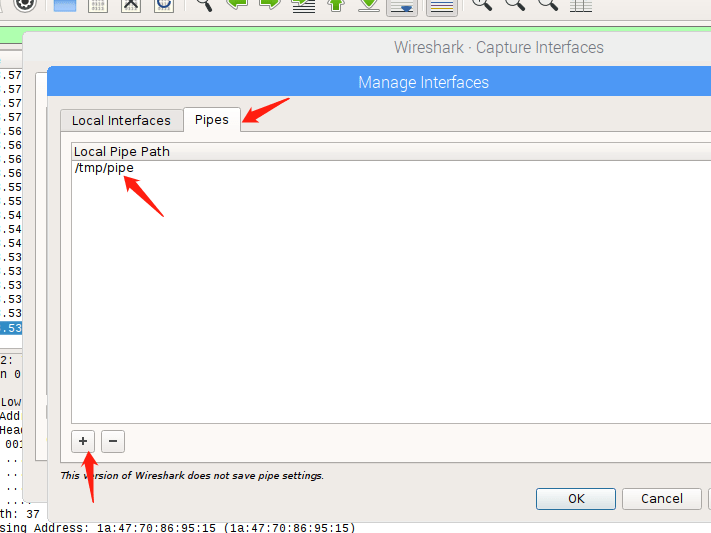</br>
        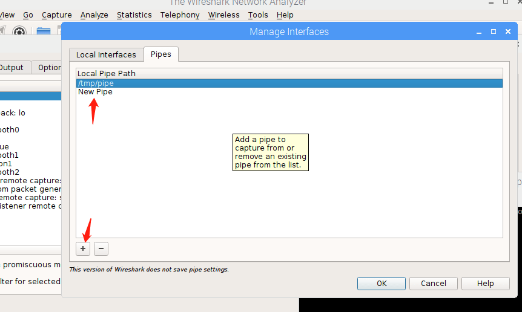</br>
        
    开始btle抓包
    ```
    ubertooth-btle -f -c /tmp/pipe
    ```
        
    配置wireshark识别btle
    1. 点击Edit -> Preferences
    2. 点击左边Protocols -> DLT_USER
    3. 点击Edit
    4. 点击+号</br>
    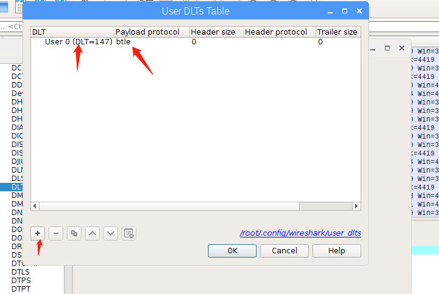</br>
    选择User 0，Payload protocol填写btle
    ok->ok</br>
    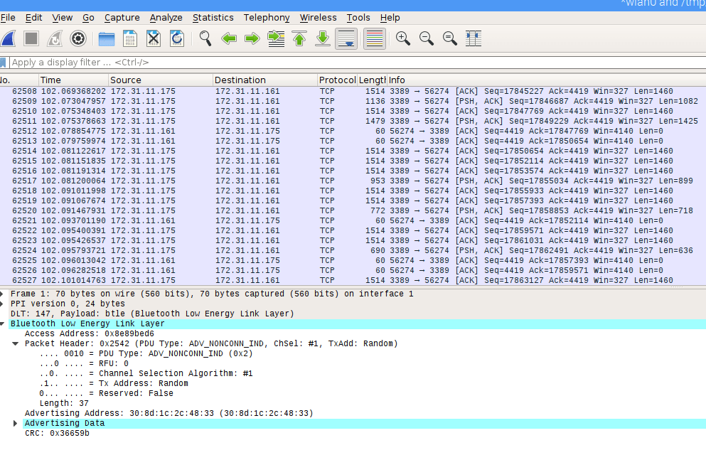</br>
    5. 过滤选择btle，或者btle_rf</br>
    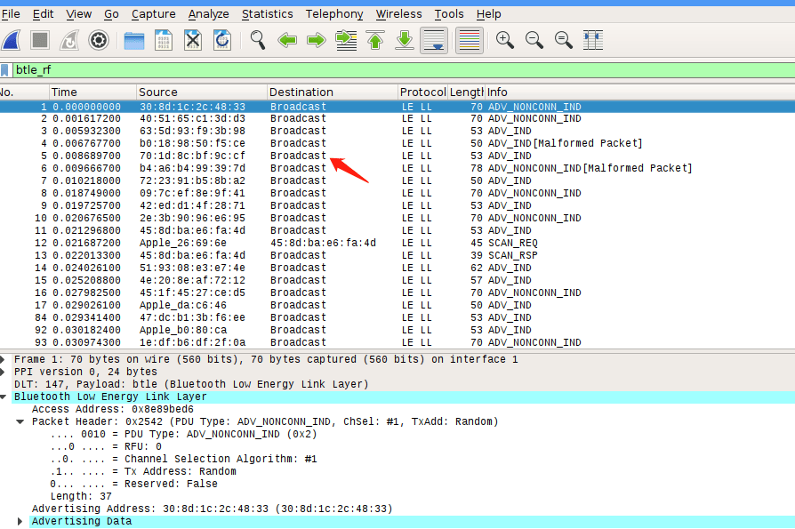
    
7. wireshark静态分析
    ```
    ubertooth-btle -f -c test.pcap #抓包&保存到本地，wireshark分析
    # wireshark过滤规则
    btle.data_header.length > 0 || btle.advertising_header.pdu_type == 0x05 #抓取连接过程
    ```
    
8. 安装spectools(项目都不更新了)

    ```
    sudo apt install spectools
    ```
    使用如下命令
    ```
    spectool_gtk # 打开实时2.4G频谱图
    ```
    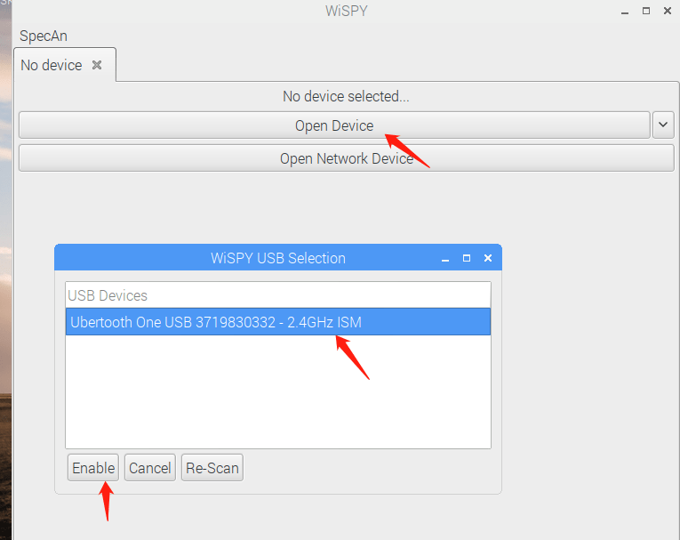
    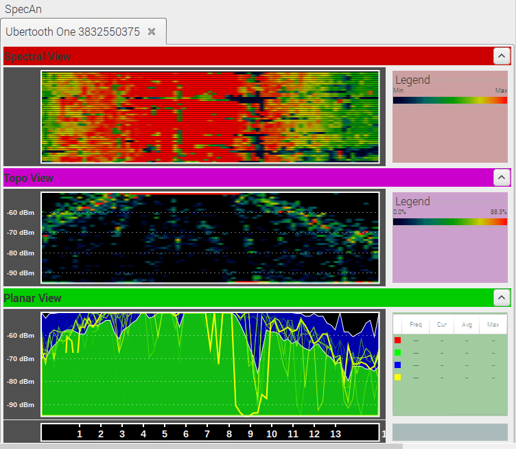
    

8. 安装kismet
    ```
    折腾了好久，不行，百度，google都不行，然后看到这个
    2018-09-26 21:59
    https://necromuralist.github.io/posts/ubertooth-2018/
    Kismet
    Now we come to the interesting installation. At this point you probably have all the command-line utilities you need, but kismet provides a convenient interface to start capturing packets. Unfortunately it is going through a major upgrade which makes it incompatible with the ubertooth plugin for it (maybe, there's two plugins and one of them might work, but they don't seem to document it (or much else, for that matter)).
    ```
    尝试安装老版本吧
    ```
    # 先编译protobuf
    sudo apt-get install autoconf libtool
    wget https://github.com/google/protobuf/releases/download/v2.6.1/protobuf-2.6.1.tar.gz
    tar -vxzf ./protobuf-2.6.1.tar.gz
    cd ./protobuf-2.6.1/
    ./autogen.sh
    ./configure
    make
    sudo make install
    sudo ldconfig
    # 最后测试一下
    protoc --version
    
    wget https://github.com/kismetwireless/kismet/archive/Kismet-2014-02-R1.tar.gz
    tar xf Kismet-2014-02-R1.tar.gz
    cd kismet-Kismet-2014-02-R1/
    ln -s ../ubertooth-2018-12-R1/host/kismet/plugin-ubertooth .
    ./configure
    make && make plugins
    sudo make suidinstall
    sudo make plugins-install
    sudo ldconfig
    ```
    ```
    sudo nano /usr/local/etc/kismet.conf #找到kismet的配置文件kismet.conf ，把”pcapbtbb”加入到kismet.conf的logtypes= 里边
    ```
    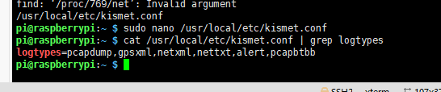
    
9. kismet怎么用
    ```
    sudo kismet
    ```
    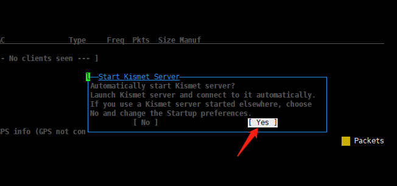</br>
    然后server这里选start</br>
    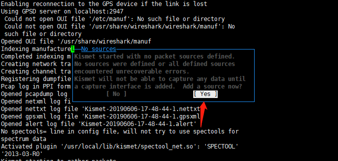</br>
    下面箭头中都填写ubertooth，然后Add</br>
    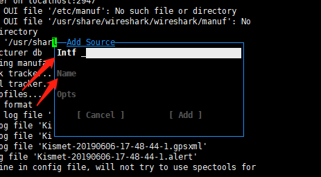</br>
    选择plugins添加ubertooth支持</br>
    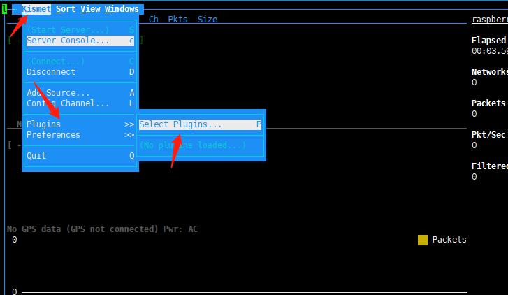</br>
    向下选择ubertooth_ui.so, tab->close.</br>
    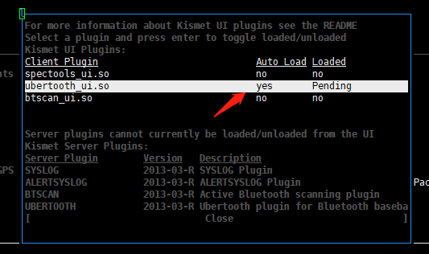</br>
    现在有了</br>
    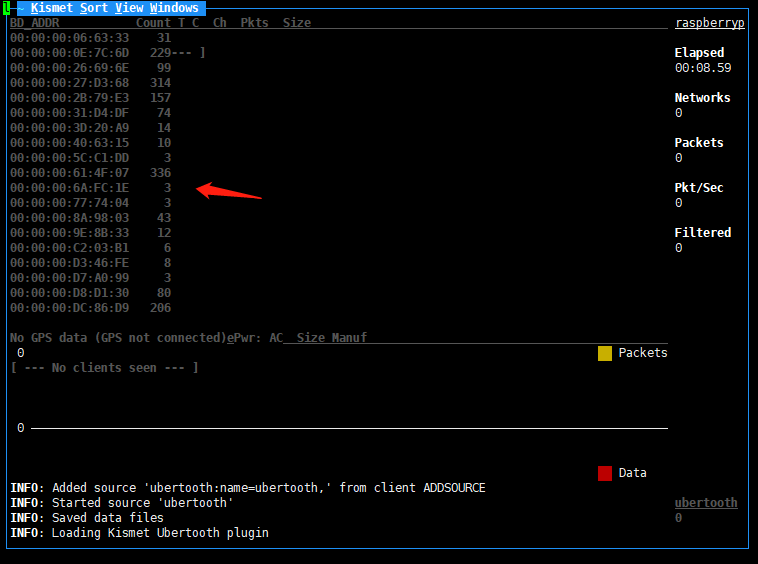</br>
    报文也有了：</br>
    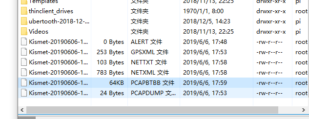</br>
    
10. 安装crackle
    ```bash
    git clone https://github.com/mikeryan/crackle.git
    cd crackle
    make
    make install
    ```
    如果捕获到足够的数据包尤其是btsmp，那接下来便可以用crackle来破解tk和ltk：

    ```bash
    crackle -i <file.pcap>
    ```
    解密数据包，并把解密后的包另存：
    ```bash
    crackle -i <file.pcap> -o <output.pcap>
    crackle -i <file.pcap> -o <out.pcap> -l <ltk>
    ```
    
        
    
    