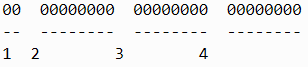
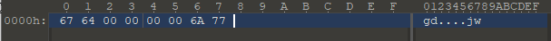
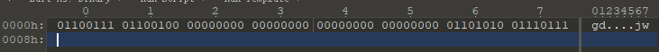

# BLE如何设计一条报文
## 举个栗子
我就想app通过蓝牙开关灯：</br>
我们的原则是报文越短越好，这样节能又快速。
1. 我们这样定义：

    | 开灯 | 01 |
    |----|----|
    | 关灯 | 10 |

    多好，1byte = 8bit，也就是8位，这个就占两位，够短，控制开关足够了。</br>
2. 我有个新需求：

    有时候我在另一个房间，不知道灯开了没了，这个怎么办，好吧，我们加一位：
    
    | 开灯 | 01 |
    |----|----|
    | 关灯 | 10 |
    | 状态 | 11 |

    打开app，我们先同步灯的状态，然后选择开关灯，然后，再获取一次状态，看看是不是真的关了。
    
3. 我又有了新需求：

    我又有了新需求，这次要控制颜色，(r, g, b)三个值，0~255哦，我知道，不用你教我，我可以这样：</br>
    </br>
    1代表开关等，2，3，4表示颜色</br>
    对，你可以按照这样一直把你的消息体加上去，在你需求不断增加的情况下，扩充你的报文，归纳一下现在的报文结构：</br>
    ```bash
    控制|颜色（R|G|B）# 这就是你现在的报文结构了，你看这个概念也不复杂。
    ```
4. 嗯，这个看起来太简陋了：

    对，是有点简陋，但是能用啊</br>
    改一下，高端一点吧~~~</br>
    好的，我们改一改，让他看起来好看一点</br>
    为了高端一点，我们给他加一个报文头，报文尾，然后细化一下报文内部，就变成了下面的结构：</br>
    ```bash
    报文头|报文内容（也就是上面我们讨论的那个了）|报文结尾
    ```
    我们细化一下（现在我们改用十六进制）：</br>
    报文头我们用高端这个词语：gd，然后转ASCII码：g=0x67, d=0x64，所以就是6764</br>
    报文尾我们用结尾这个词语：jw，同样就是6a77</br>
    报文体我们不差这几个byte，所以我们扩充一下，控制用一个byte，三个颜色我们用三个byte，多好：</br>
    现在就变成了这样</br>
    </br>
    换成二进制：</br>
    </br>
    高端了吧，开起来对得起报文的样子了。</br>
5. 嗯，那个老板说报文长了，但是有好多bit没有在用啊，浪费了多可惜，再改改：

    好吧，既然多了这么多位，我们再加工一下：</br>
    1. 我们设计一个空位，用来隔离报文的各个结构</br>
    2. 报文体我们对每一个结构再加一个长度控制，然后再来个crc校验</br>
    现在变成了这样:</br>
    ```bash
    报文头gd|空位|控制|控制长度|空位|rgb|rgb长度|空位|CRC|空位|报文尾
    ```
    空位好像有点多，我们优化优化：
    ```bash
    报文头gd|空位|控制|控制长度|rgb|rgb长度|CRC|空位|报文尾
    ```
6. 话说你这个crc是什么作用？</br>
    发送报文的时候，可能出现报文出错，一条长度为10的报文，后面的几条没有接收到，就接收到了7个长度，这时接收方怎么判断收到了完整的报文呢？crc的功能就是为了帮助接收方判断报文完整程度。</br>

## 好了，我们现在考虑一下别的问题
1. 我们要加密，提高安全性（老板说，这是个好）：</br>
    加，我们改改报文体，马上加，我们想了想，改成这样：</br>
    ```bash
    报文头gd|空位|加密的报文体|空位|报文尾
    ```
    加密的报文体 = 加密方法（原始报文体）
    
2. 老板说要保证报文防止被重放，就是别人截获了app发出去的报文，不能解密了，但是还可以控制我们的灯啊！！！！！！！！！！！！</br>
    好……好吧，我们再改改</br>
    加几天班，我们改改</br>
    诶，我们可以这样，设计一个报文序号，来控制重放，具体是这样的：
    ```bash
    报文头gd|空位|加密的报文体|空位|报文尾
    ```
    其中加密的报文体部分我们修改成这样:
    ```bash
    报文序号|期待下次发过来的报文序号|控制|控制长度|rgb|rgb长度|CRC
    ```
    然后改改你的灯解析报文的逻辑</br>
    保存上次发过来的报文A的序号与期待下次发过来的报文序号，下次发过来报文B后，对B（报文序号）==A（下次发过来的报文序号），相等就控制，不相等就丢弃。</br>
    终于把报文重放解决了，回家睡觉。
    
3. 我们老板说明文好像也可以保障灯的控制安全啊，你这个加密了啊，是不是可以优化一下：</br>
    一个灯怎么要玩出这么多花样啊~~~~~，我不想做你的生意了</br>
    改改，改改，就剩尾款了……………………</br>
    我</br>
    好的，我马上研究一下</br>
    打开百度，Google，我们找到了[HMAC](https://zh.wikipedia.org/wiki/%E9%87%91%E9%91%B0%E9%9B%9C%E6%B9%8A%E8%A8%8A%E6%81%AF%E9%91%91%E5%88%A5%E7%A2%BC)</br>
    然后报文体就变成这样：</br>
     ```bash
    报文序号|期待下次发过来的报文序号|控制|控制长度|rgb|rgb长度|HMAC|CRC
    ```
4. 这样一条消息基本就设计完成。

    
    
    

    
    
    
    

    
    

    
    
    
    
    
    
    
    
    
