# 手机扫描蓝牙过程分析

应用层要进行蓝牙设备扫描啦，Host先发一条HCI_Inquiry的Command通知Controller

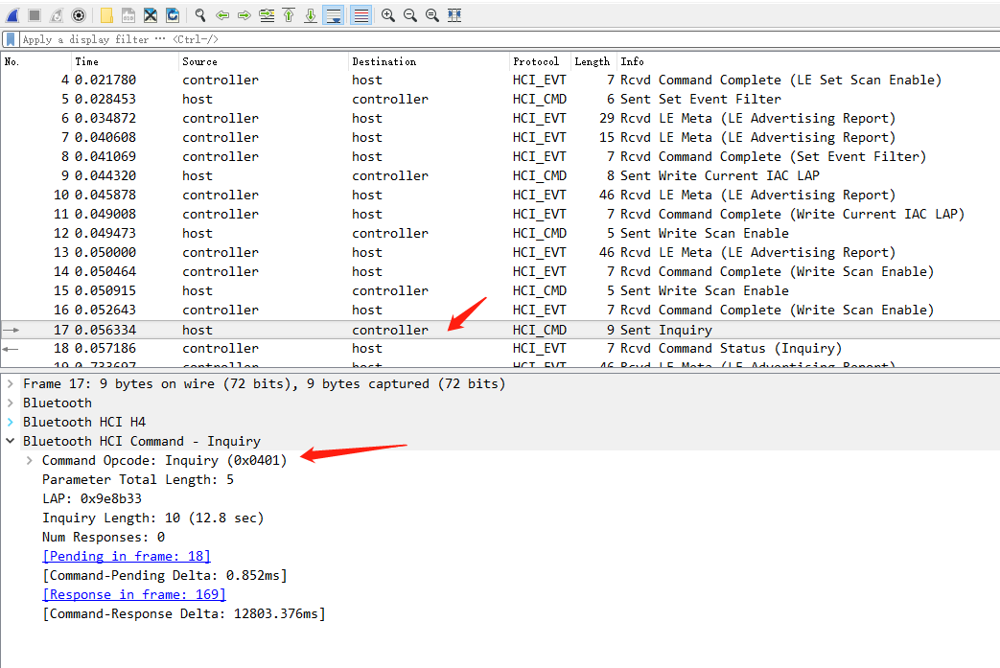

Controller在收到HCI_Inquiry这条Command后，会回复一条Command Status的HCI Event，来表示Controller执行HCI_Inquiry后的状态

从view中我们来看一下

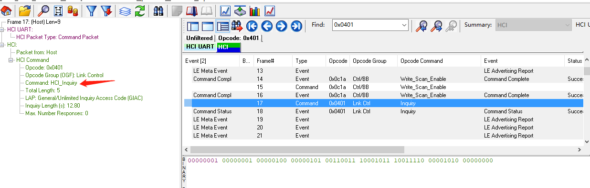

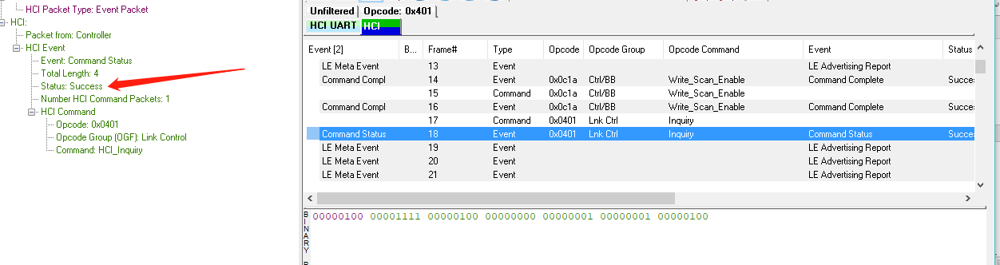

Controller回复host后，开始将收到的le的广播提交给host

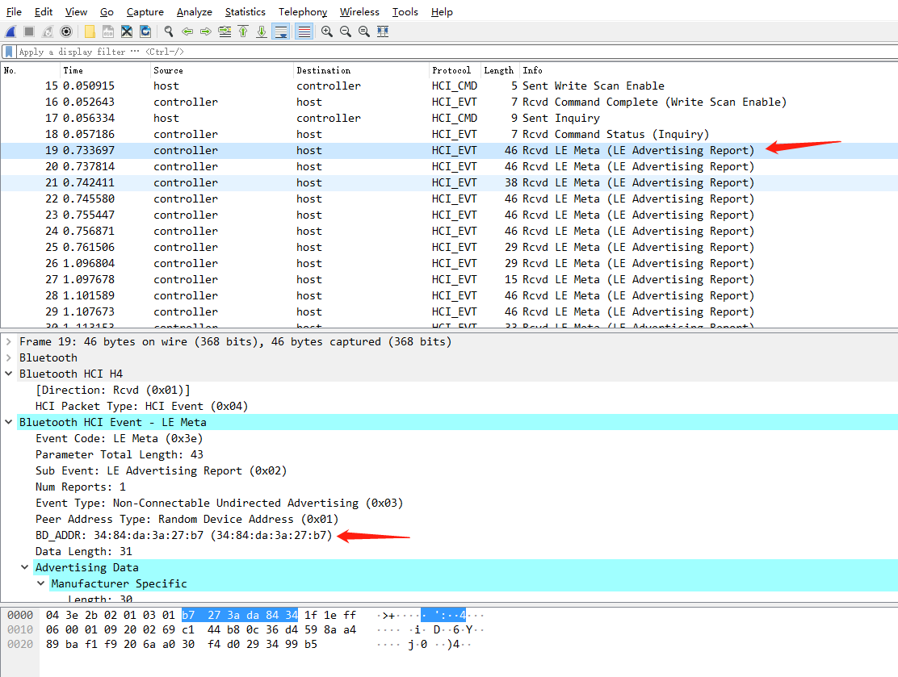

这里有个LE Meta，HCI事件包括BLE专有事件和通用事件，通用事件适用于经典蓝牙和BLE。BLE专有事件称为“元事件（LE Meta Event）”，共有20个，它们的事件代码均为0x3E，事件参数的第一个字节为Subevent_code，用以区分不同的元事件。

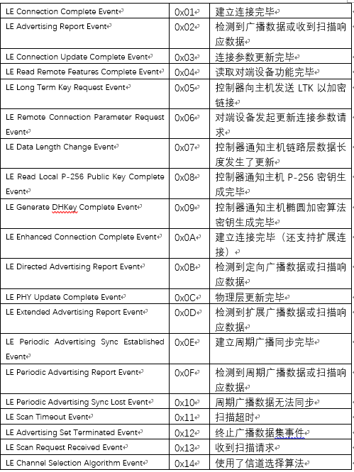

我们看看view中的数据，这个操作属于LE Meta Event中的Advertising Report操作，从上面的表中我们看到检测到广播数据或收到扫描响应数据，这里是收到从机的广播数据。

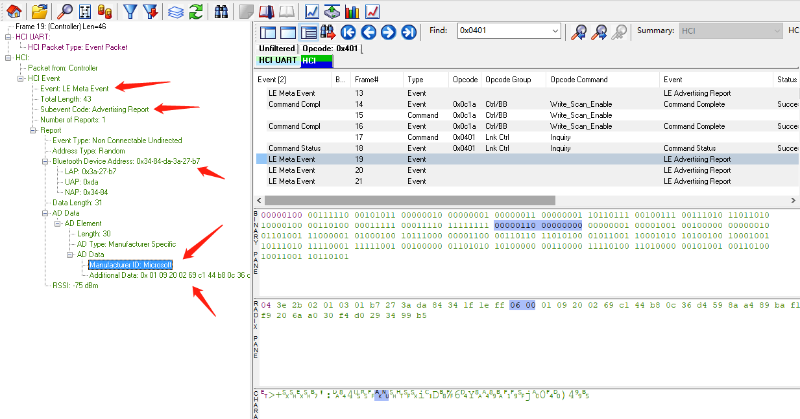

扫面完成后，controller会向host发送event：HCI Extended Inquiry Result，我们看看这个报文：

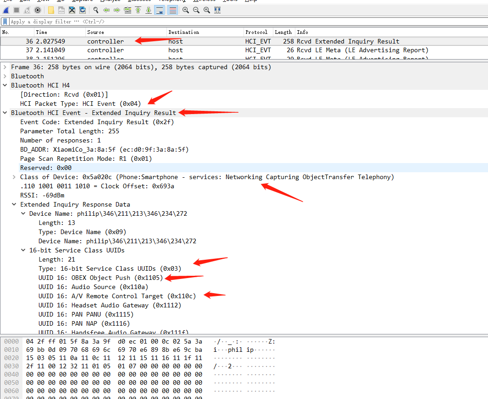

数据包中会包含它的设备名称、它所支持的Service的UUID，和设备类型：Wearable Headset device

从view中看一下，这里看的比较清晰

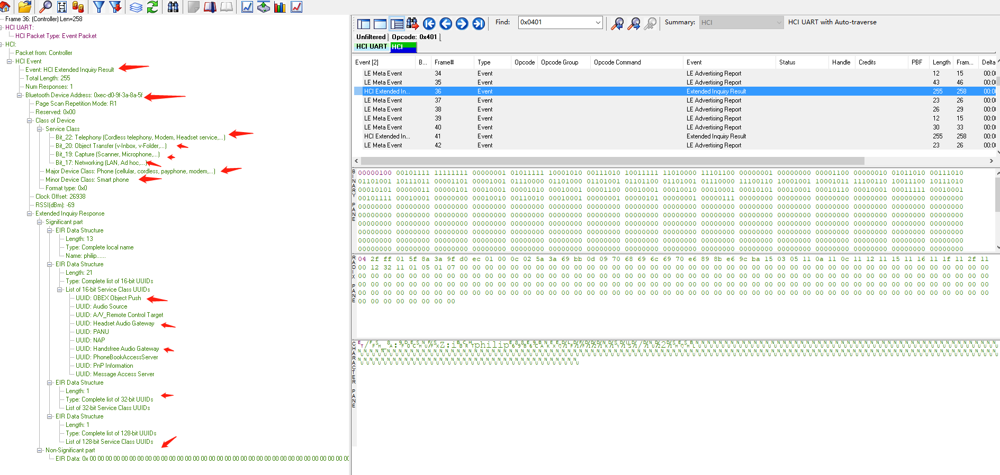

这里就比较详细了

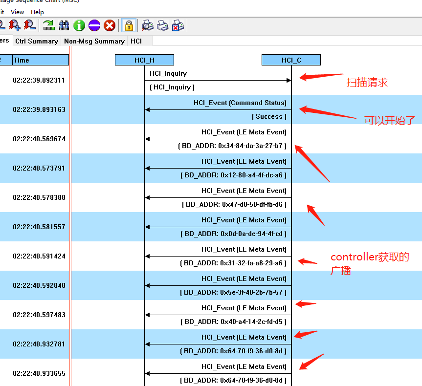

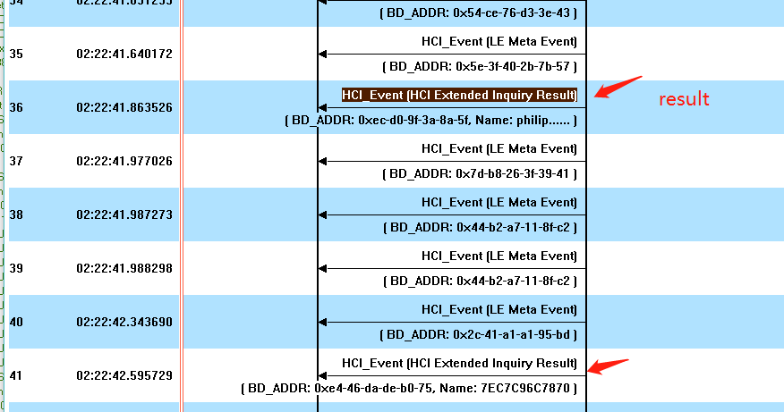

到这里扫描分析结束了

**绑定分析**

下面我们来看一下绑定过程

HCI层绑定

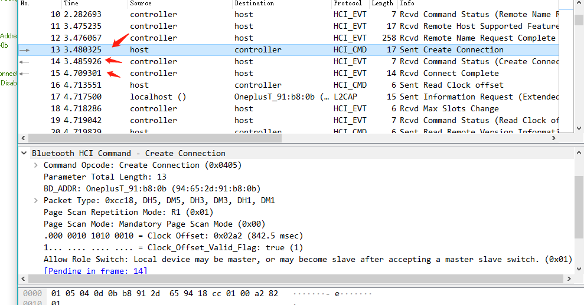
 
HCI层绑定全过程：

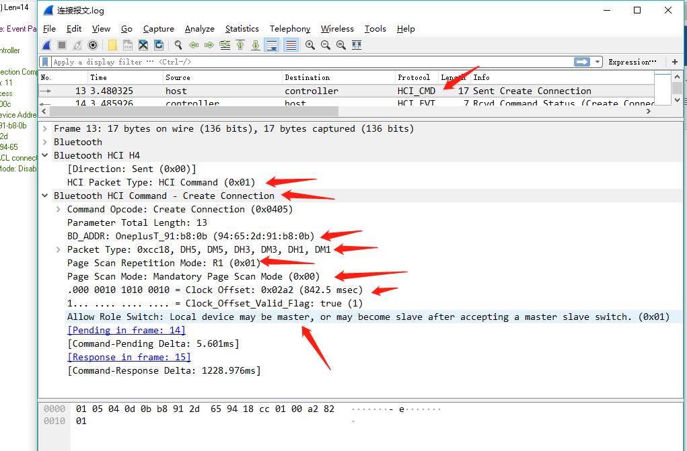
 
Host发起请求，提供地址，模式等等信息
 
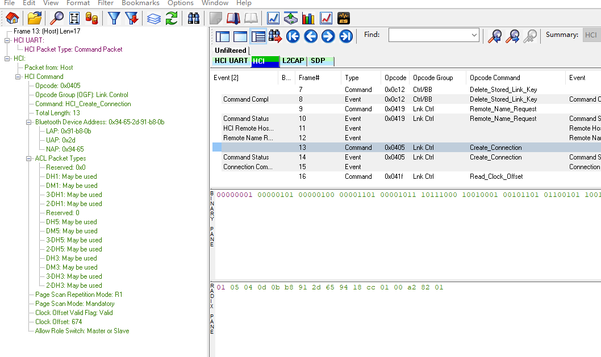

Controller响应：
第一步先做command status响应，告诉host我知道了
 
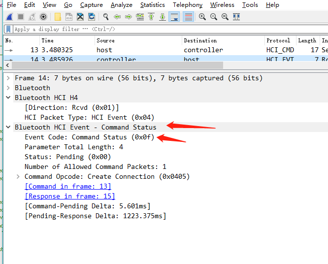

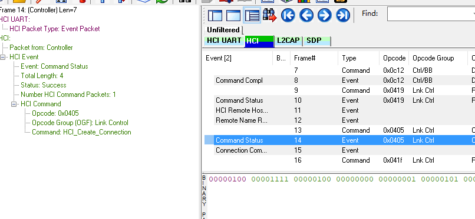
 
第二步响应Connection Complete event，告诉host连接上了

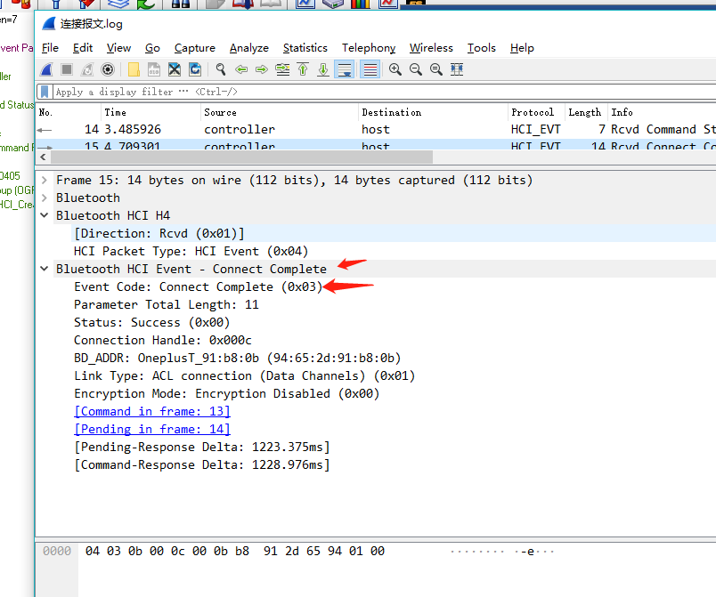
 
建立ACL Connection在HCI层上看比较简单，只有Create_Connection command和Command status event以及Connection Complete event两个event。在建立连接后，得到重要的Connection handle，建立起ACL连接，这个连接一旦建立起来，L2CAP signaling channel(CID = 0x0001)就已经存在

好了，先到这里